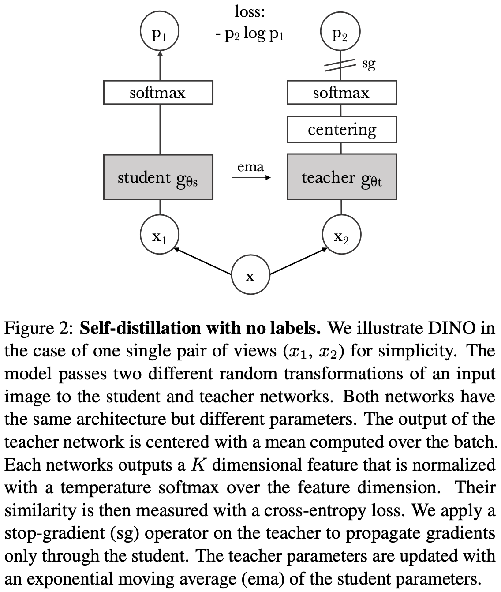

[PyTorch] DINO: self-DIstillation with NO labels
=====
PyTorch implementation of "Emerging Properties in Self-Supervised Vision Transformers"

## Concept

      
  
Concept ot the DINO [1].

## Results
||Student ($x_1$)|Teacher ($x_2$)|
|:---|:---:|:---:|
|Before|  ||  
|After|  ||  

## Requirements
* PyTorch 2.0.1

## Reference
[1] Mathilde Caron, et al. <a href="https://openaccess.thecvf.com/content/ICCV2021/html/Caron_Emerging_Properties_in_Self-Supervised_Vision_Transformers_ICCV_2021_paper.html">"Emerging Properties in Self-Supervised Vision Transformers."</a> Proceedings of the IEEE/CVF International Conference on Computer Vision (ICCV), 2021.